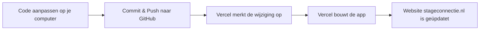

# 📘 Technisch Beheer Playbook - StageConnectie

Dit document is je **ultieme gids voor zelfstandigheid**. Als ik (de AI-assistent) niet meer bereikbaar ben, of als je besluit om met een andere ontwikkelaar of een andere AI te gaan werken, bevat dit bestand alle technische details om de applicatie draaiende te houden, aan te passen en te beheren.

---

## 🗺️ 1. Architectuur in het kort

StageConnectie is bewust gebouwd met een **eenvoudige en robuuste technische stack**. Dit betekent dat je niet afhankelijk bent van complexe frameworks en dat vrijwel elke webontwikkelaar ter wereld je code kan begrijpen.

*   **Frontend (Wat de gebruiker ziet):** Pure HTML, CSS en JavaScript (Vanilla JS). Geen zware frameworks zoals React of Angular. De bestanden staan direct in de hoofdmap van je project (bijv. `index.html`, `employer-portal.html`, `supervisor-portal.html`, `student-portal.html`).
*   **Hosting:** De frontend wordt gehost op [Vercel](https://vercel.com). Vercel is gekoppeld aan je GitHub-repository en update de website automatisch zodra er code wordt gewijzigd.
*   **Backend & Database:** [Supabase](https://supabase.com). Supabase slaat alle gegevens (studenten, bedrijven, begeleiders, aanwezigheid) op en regelt de authenticatie (inloggen).
*   **Edge Functions:** Kleine stukjes servercode op Supabase (bijv. `create-auth-account`) die veilig nieuwe accounts aanmaken zonder dat inloggegevens op straat komen te liggen.

---

## 🔑 2. Jouw Digitale Sleutelbos (Essentiële Accounts)

Om 100% onafhankelijk te zijn, moet jij de **enige eigenaar** zijn van de volgende accounts. Zorg dat je de inloggegevens opslaat in een veilige wachtwoordmanager (zoals Bitwarden, 1Password of iCloud Sleutelhanger):

1.  **GitHub Account:** Beheert de broncode (`vesseurw-design/stage-connectie-app`).
2.  **Vercel Account:** Beheert de hosting en koppeling met je domeinnaam (`stageconnectie.nl`).
3.  **Supabase Account:** Beheert je database en Edge Functions. Project ID: `vdeipnqyesduiohxvuvu`.
4.  **Domein Registrar:** De partij waar je `stageconnectie.nl` hebt gekocht (bijv. Hostnet, TransIP, Mijn.host). Hier beheer je de DNS-instellingen.

> [!IMPORTANT]
> Geef externe partijen of tijdelijke ontwikkelaars nooit direct je hoofdwachtwoorden. Geef ze in plaats daarvan 'collaborator' of 'team member' toegang binnen GitHub, Vercel en Supabase. Zo behoud jij altijd de controle en kun je hun toegang intrekken wanneer dat nodig is.

---

## 💻 3. Lokale Ontwikkeling (Zelf aan de knoppen)

Je kunt de applicatie eenvoudig op je eigen computer draaien en testen zonder dat dit invloed heeft op de live website.

### Stappen om lokaal te testen:
1.  **Open de map** `Stage app/stage-connect-app` in een code-editor zoals **VS Code**.
2.  **Start een lokale server:**
    *   De makkelijkste manier is om de VS Code extensie **"Live Server"** te installeren. Klik onderaan in VS Code op "Go Live".
    *   Alternatief via de Terminal:
        ```bash
        npx serve .
        ```
        Je kunt de website dan openen op `http://localhost:3000` (of een andere poort die Vercel/serve aangeeft).
3.  **Omgevingsvariabelen (`.env.local`):**
    Dit bestand bevat de koppeling met je Supabase database:
    *   `REACT_APP_SUPABASE_URL`: De API-link naar je Supabase-project.
    *   `REACT_APP_SUPABASE_ANON_KEY`: De openbare sleutel voor database-toegang.

---

## 🛠️ 4. Debuggen (Wat te doen bij fouten?)

Als er iets niet werkt (bijvoorbeeld: gegevens laden niet, of inloggen mislukt), kun je zelf de eerste diagnose stellen:

1.  Open de website lokaal of live.
2.  Druk op **F12** (of `Cmd + Option + J` op Mac) om de **Browser Ontwikkelaarstools** te openen.
3.  Ga naar het tabblad **Console**.
4.  Rode teksten zijn foutmeldingen (Errors). Deze geven bijna altijd aan wat er mis is (bijvoorbeeld een mislukte netwerkoproep naar Supabase of een syntaxfout in JavaScript).
5.  *Kopieer deze foutmeldingen.* Elke AI of menselijke developer kan hiermee binnen enkele minuten het probleem oplossen.

---

## 🗄️ 5. De Database Structuur (Supabase)

De database bestaat uit de volgende belangrijke tabellen. Als je handmatig gegevens wilt aanpassen of inzien, doe je dit via de **Table Editor** in het Supabase Dashboard:

*   **`Students`:** Bevat alle leerlingen. Belangrijke kolommen:
    *   `email`: Het e-mailadres waarmee de leerling inlogt.
    *   `company_id`: UUID die linkt naar de tabel `Bedrijven` (stagebedrijf).
    *   `supervisor_id`: UUID die linkt naar de tabel `Stagebegeleiders` (begeleider vanuit school).
*   **`Bedrijven`:** Bevat alle stagebedrijven en hun inloggegevens (e-mail).
*   **`Stagebegeleiders`:** Bevat de docenten/begeleiders die de voortgang bewaken.
*   **`Attendance`:** Slaat de aanwezigheid per dag/week op.
    *   Heeft een *Unique Constraint* op `(student_id, date)` om dubbele invoer te voorkomen.

---

## 🚀 6. Hoe updates live gaan (Deployment)

De live-gang van wijzigingen is volledig geautomatiseerd via Git en Vercel:



Als je handmatig een release wilt controleren, ga je naar het **Vercel Dashboard** → **Deployments** om te zien of de laatste build is geslaagd.

---

## 🤖 7. Werken met andere AI-assistenten

Als ik er niet meer ben, kun je andere krachtige AI-tools gebruiken die direct in je code-editor werken. De twee beste opties op dit moment zijn:

1.  **Cursor (editor):** dit is een directe vervanger voor VS Code, maar volledig gebouwd rondom AI. Je kunt simpelweg je projectmap openen in Cursor, `Cmd + L` drukken om met de AI te chatten, en de AI vragen om code aan te passen. Cursor kan je hele project lezen en begrijpt de context direct.
2.  **Cline / Roo-Cline (VS Code extensie):** Dit is een extensie voor de standaard VS Code. Je kunt deze koppelen aan AI-modellen (zoals Claude 3.5 Sonnet of GPT-4o). Cline kan bestanden lezen, schrijven en commando's in je terminal uitvoeren om bijvoorbeeld database-migraties te testen.

### Hoe je een nieuwe AI instrueert:
Als je een nieuwe AI-chat start, geef hem dan altijd deze eerste prompt:
> *"Ik werk aan het project StageConnectie. Lees het bestand `TECHNISCH_BEHEER_PLAYBOOK.md` in de hoofdmap van het project om de architectuur en database-structuur te begrijpen. Help mij met de volgende taak: [jouw taak hier]."*

---

## 👥 8. Samenwerken met een menselijke ontwikkelaar

Mocht je tegen een probleem aanlopen dat te complex is voor een AI, of wil je een grote nieuwe feature bouwen? Omdat StageConnectie is gebouwd met **standaard webtechnologie (HTML/JS/Supabase)**, kan elke freelance webontwikkelaar hier direct mee aan de slag.

### Wat geef je aan een ontwikkelaar?
1.  Toegang tot de **GitHub-repository**.
2.  Toegang tot het **Supabase-project** (als 'developer' of 'collaborator').
3.  Dit playbook (`TECHNISCH_BEHEER_PLAYBOOK.md`).

Binnen een uur zal een ervaren ontwikkelaar de structuur begrijpen en productief kunnen zijn. Je hoeft dus nooit bang te zijn dat je "vast" zit aan één persoon of één AI!
